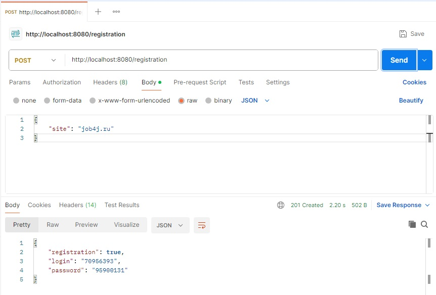
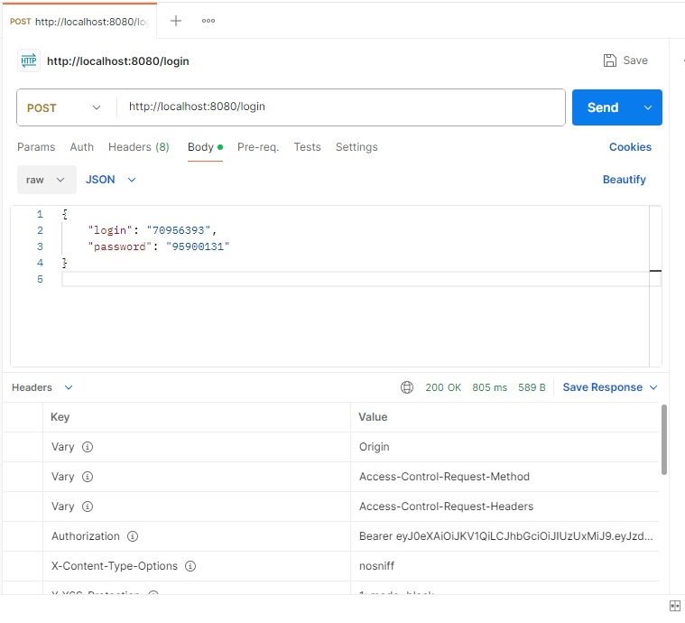
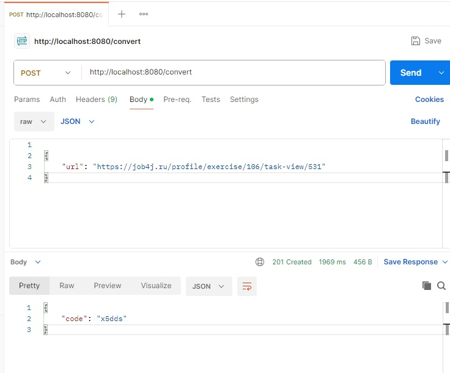
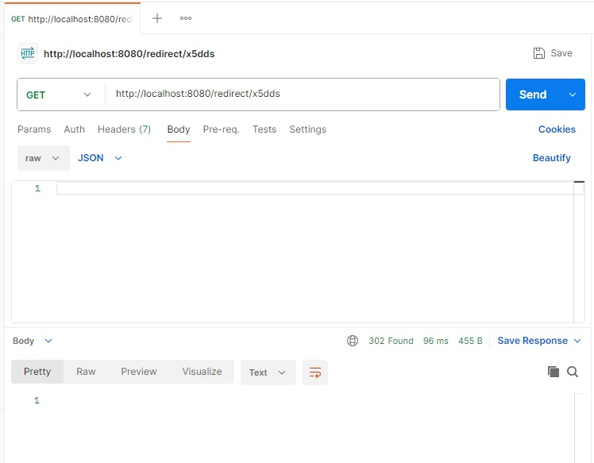
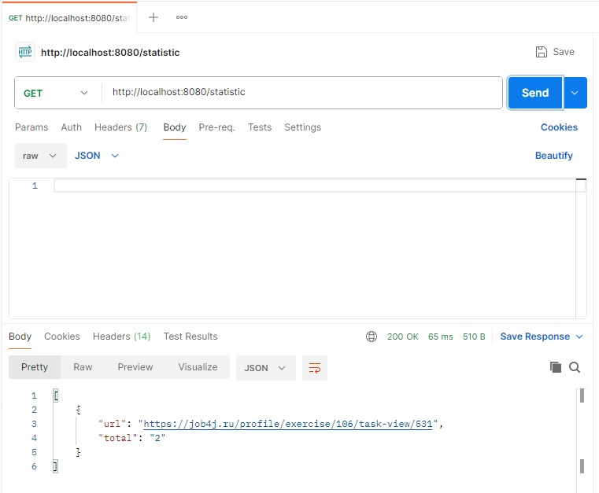

### Название проекта: 
***job4j_url_shortcut***
___
### Описание: 
Данный сервис на основе REST API отвечает за преобразование ссылок: ссылки на сайт заменяются ссылками на сервис.
___
### Стек технологий: 
+ Spring Boot 2.7.14
+ Spring Data JPA 2.7.14 
+ Spring Security 2.7.14 
+ Spring Validation 2.7.14 
+ Spring Web 2.7.14
+ PostgreSQL 42.3.8;
+ Liquibase 4.15.0
+ Lombok 1.18.30
___
### Требования к окружению: 
+ Java 17, 
+ Maven 3.8, 
+ PostgreSQL 14;
___
### Запуск проекта: 
+ В PostgreSQL создать базу данных командой ```create database url_shortcut```;
+ Запустить проект командой ```mvn spring-boot:run```;
___
### Работа с приложением:
 ***Ключевые функции:***
+ *1. Регистрация сайта.
Сервисом могут пользоваться разные сайты. Каждому сайту выдается пароль и логин.
Чтобы зарегистрировать сайт, в систему нужно отправить запрос.
```POST /registration```.
C телом JSON объекта: ```{site : "job4j.ru"}```.
Ответ от сервера: ```{registration : true/false, login: УНИКАЛЬНЫЙ_КОД, password : УНИКАЛЬНЫЙ_КОД}```.
Флаг registration указывает, что регистрация выполнена или нет, то есть сайт уже есть в системе.*
  

+ *2. Авторизация.
Авторизация осуществляется через JWT. Пользователь отправляет POST запрос с login и password и получает токен.
В заголовке Authorization приходит значение токена.
```Authorization: Bearer ```.
  
+ 
+ *3. Регистрация URL.
После регистрации сайта пользователь может отправлять ссылки и получать их преобразованные версии.
Пример.
Отправляем URL: ```https://job4j.ru/profile/exercise/106/task-view/531```.
Получаем ключ: ```x5dds```, который ассоциирован с URL.
Опишем вызовы: ```POST /convert```.
C телом JSON объекта: ```{url: "https://job4j.ru/profile/exercise/106/task-view/531"}```
и заголовком  Authorization со значением полученного токена.
Ответ от сервера: ```{code: УНИКАЛЬНЫЙ_КОД}```*
  
+ *4. Переадресация. Выполняется без авторизации.
В ответ на отправленную сайтом ссылку с кодом сервер возвращает ассоциированный URL и HTTP‑статус 302.
Вызовы: ```GET /redirect/УНИКАЛЬНЫЙ_КОД```.
Ответ от сервера в заголовке: ```HTTP CODE - 302 REDIRECT URL```*
  
+ *5. Статистика.
Сервис ведёт учёт количества обращений к каждому адресу. По специальной ссылке доступна статистика по всем адресам с указанием числа их вызовов.
Вызовы: ```GET /statistic```.
Ответ от сервера JSON: ```{url : "https://job4j.ru/profile/exercise/106/task-view/531", total : 2}```*
  
___
### Контакты: 
Телеграм: @AlexKrmv